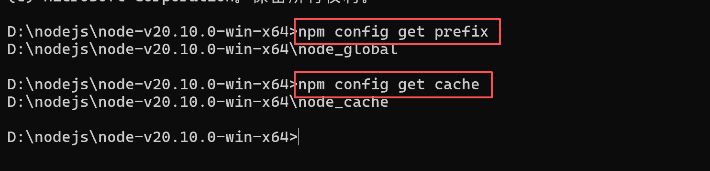
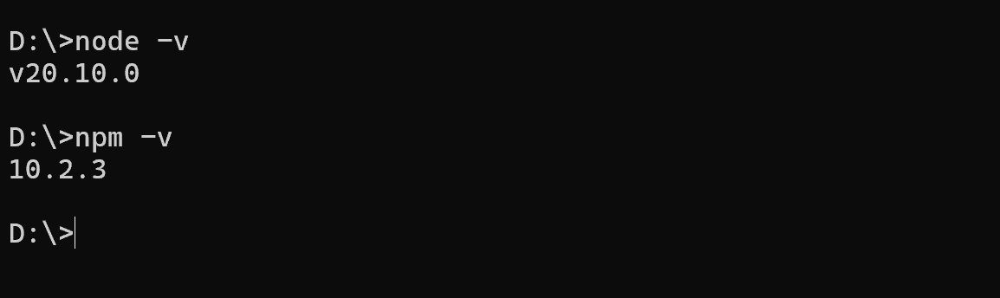
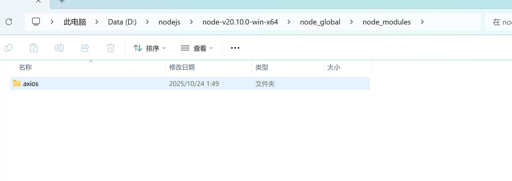
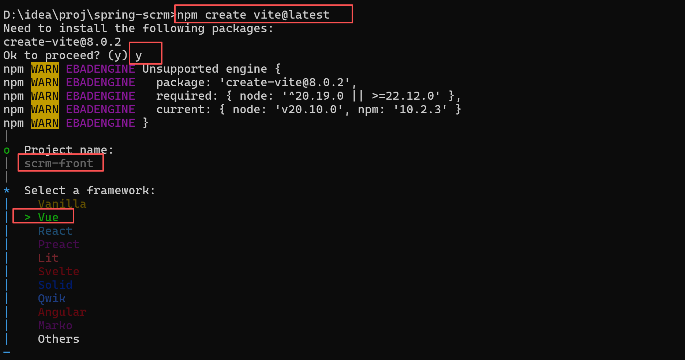

# 开发环境准备

数据库表结构详见 [表结构](./files/dlyk.sql)，需要在数据库中先创建 `database` 然后再导入数据库文件 (可以使用导入命令 `source dlyk.sql`);

## 前端环境

`node.js`、`npm`、`vite` 三个工具

- `node.js` 是一个开源、跨平台的 `JavaScript` 运行时环境，可以理解成 `java` 中的 `jdk`，官网地址 `https://nodejs.org/en`;
- `npm` 是 `JavaScript` 依赖包管理工具，可以用来共享 `JavaScript`包、负责前端项目的打包，插件下载等，可以理解为 `maven`，官网地址 `https://www.npmjs.com/`;
- `Vite` 是快速构建前端 `Vue` 项目的脚手架，可以理解为开发 `Spring Boot` 的 `Spring Initializer` 快速构建工具，官网地址 `https://cn.vitejs.dev/`;

### `nodejs` 安装

下载 `nodejs` 压缩包并解压 (版本: `node-v20.10.0-win-x64.zip`)

> 配置 `nodejs` 环境变量

1. 在 `nodejs` 解压目录 (`D:\nodejs\node-v20.10.0-win-x64>`) 下创建两个目录
   1. `node_global`: npm的全局安装根目录，使用 `npm install -g <package>` 安装的全局包会存放在该目录下的 `node_modules` 目录下;
   2. `node_cache`: 存储下载的包，所有通过 `npm install` 下载的包会永久缓存到该目录下的 `_cacache/content-v2/` 目录下，文件会以 `SHA-512` 哈希命名;
2. 在 `nodejs` 解压目录下执行一下命令
   1. `npm config set prefix D:\nodejs\node-v20.10.0-win-x64\node_global`
   2. `npm config set cache D:\nodejs\node-v20.10.0-win-x64\node_cache`
3. 查看配置是否成功
   - `npm config get prefix`
   - `npm config get cache`

4. 配置环境变量，在 path 路径下添加如下路径
   - `D:\nodejs\node-v20.10.0-win-x64`
   - `D:\nodejs\node-v20.10.0-win-x64\node_global`
   - 此时可以在任意路径下执行 `node` 和 `npm` 命令
   

> 配置 `npm` 仓库源

使用 `npm config get registry` 命令可以查看 `npm` 当前的仓库源

```text
D:\>npm config get registry
// 默认的镜像源是国外的，下载速度慢，下载失败的概率大
https://www.npmjs.com/
```

修改 `npm` 的镜像源为淘宝的镜像源 `https://registry.npmmirror.com/`

```text
npm config set registry https://registry.npmmirror.com/
```

安装一个模块验证下载源

```text
// -g 表示全局安装的意思，下载的 axios 模块会安装到 ./node_global 目录下
// 不添加  -g 则表示会安装到当前目录下
npm install axios -g
```




### `Vite` 安装

`vite` 是 `vue.js` 的脚手架，用于自动生成 `vue.js` 的项目模板 (项目基础框架)。

`npm create vite@latest`

`npm` 是 `Node Package Manager` 的缩写，是 `Node.js` 的一个包管理工具。`create` 是一个 `npm` 命令，用于创建一个新的 `npm` 包。`vite` 是一个基于 `Vue.js` 的静态网站生成器, `@latest` 表示使用最新版本的 `vite`



### `Vue` 项目目录结构说明

```text
scrm-front/
├── .vscode/                 # VS Code编辑器配置文件目录
├── node_modules/            # 项目依赖包目录（npm安装的所有依赖）
├── public/                  # 静态资源目录（不经过构建处理）
│   └── vite.svg            # Vite框架的Logo图标
├── src/                     # 项目源代码目录
│   ├── assets/             # 静态资源目录（经过构建处理）
│   ├── components/         # Vue组件目录
│   ├── App.vue             # Vue应用根组件
│   ├── main.js             # 应用入口文件
│   └── style.css           # 全局样式文件
├── .gitignore              # Git版本控制忽略文件配置
├── index.html              # 项目主HTML文件
├── package.json            # 项目配置和依赖管理文件
├── package-lock.json       # 依赖版本锁定文件
├── README.md               # 项目说明文档
└── vite.config.js          # Vite构建工具配置文件
```

### `Vue` 项目启动

在 `vite.config.js` 文件下可以配置项目的启动配置

```text
import {defineConfig} from 'vite'
import vue from '@vitejs/plugin-vue'

// https://vite.dev/config/
export default defineConfig({
    plugins: [vue()],

    server: {
        host: '127.0.0.1',  // ip
        port: 8081, // 端口
        open: true  // 配置启动时是否自动打开浏览器
    }
})
```

进入 `scrm-front` 目录，执行 `npm run dev` 启动项目;

### `Vue` 项目开发

`.vue` 结尾的文件就是 `vue` 页面，也成为 `vue` 组件，`Vue` 组件一般由三个部分组成:

- `<template>` 标签，里面写 `html` 页面要展示的内容;
- `<script>` 标签，里面写 `javascript` 代码;
- `<style>` 标签，里面写 `css` 样式;

